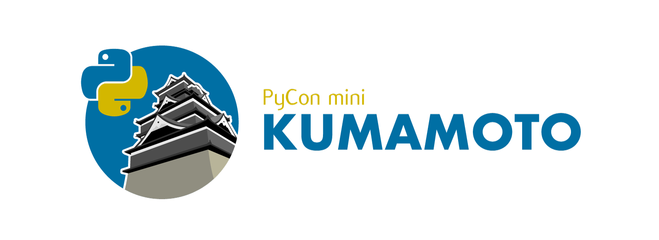
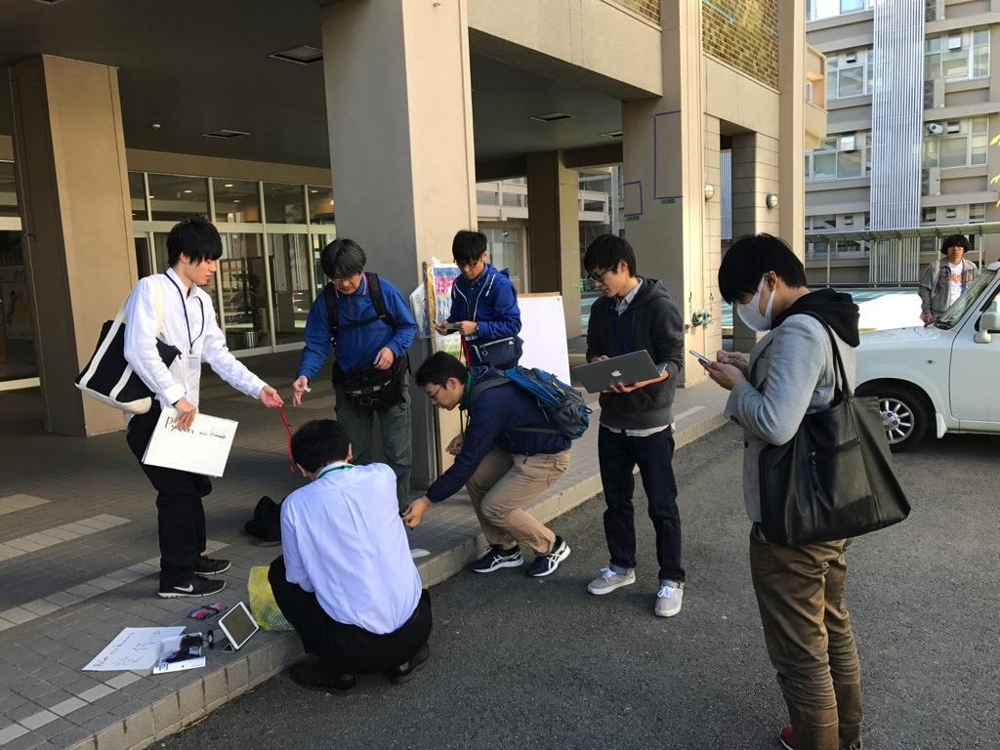
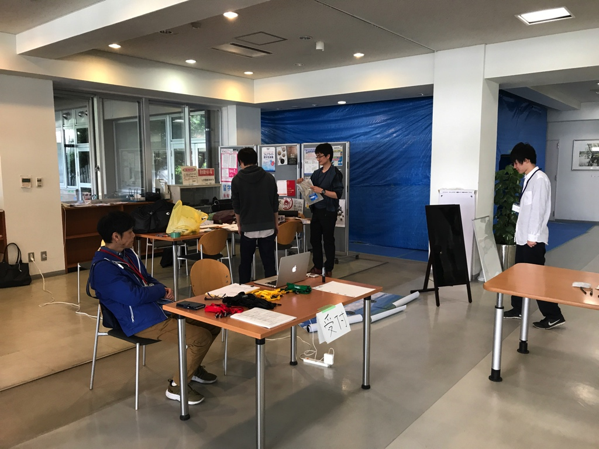
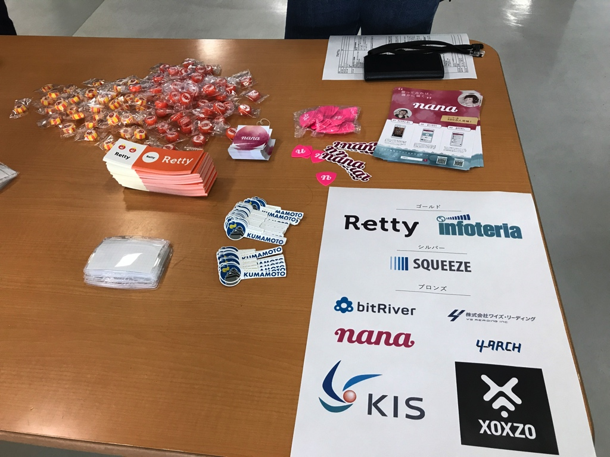
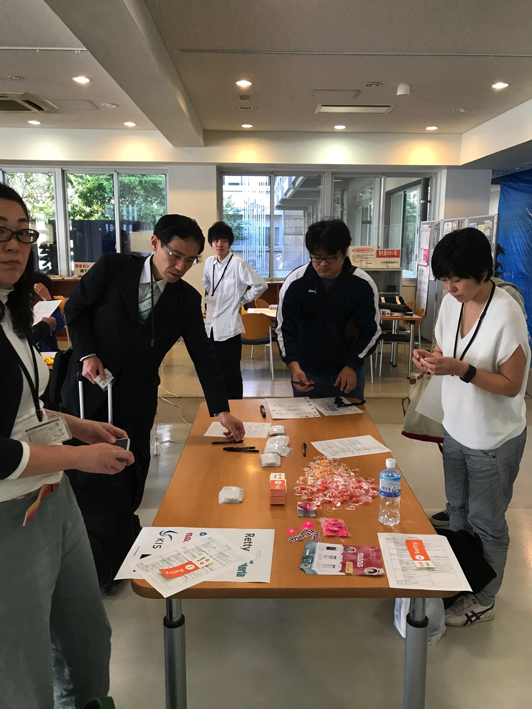
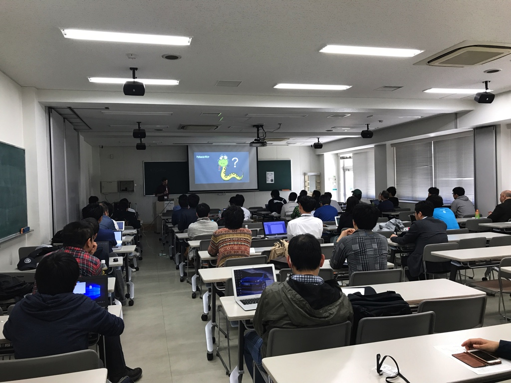
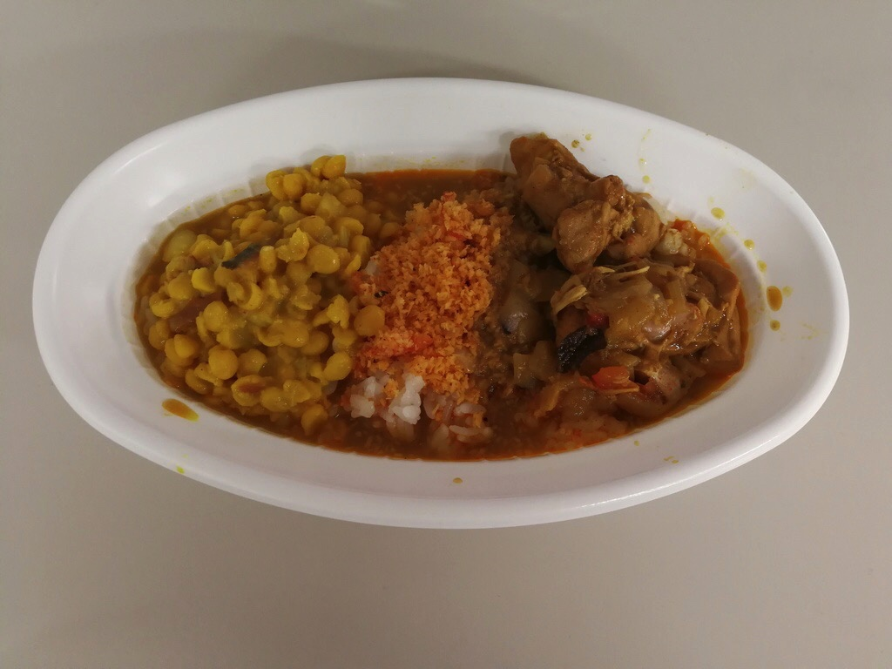
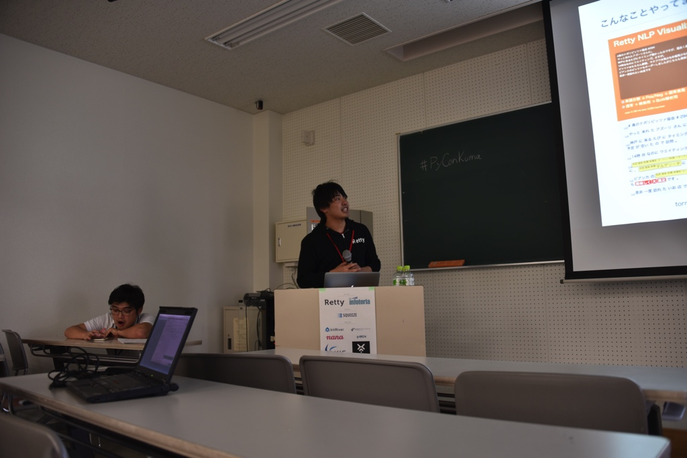
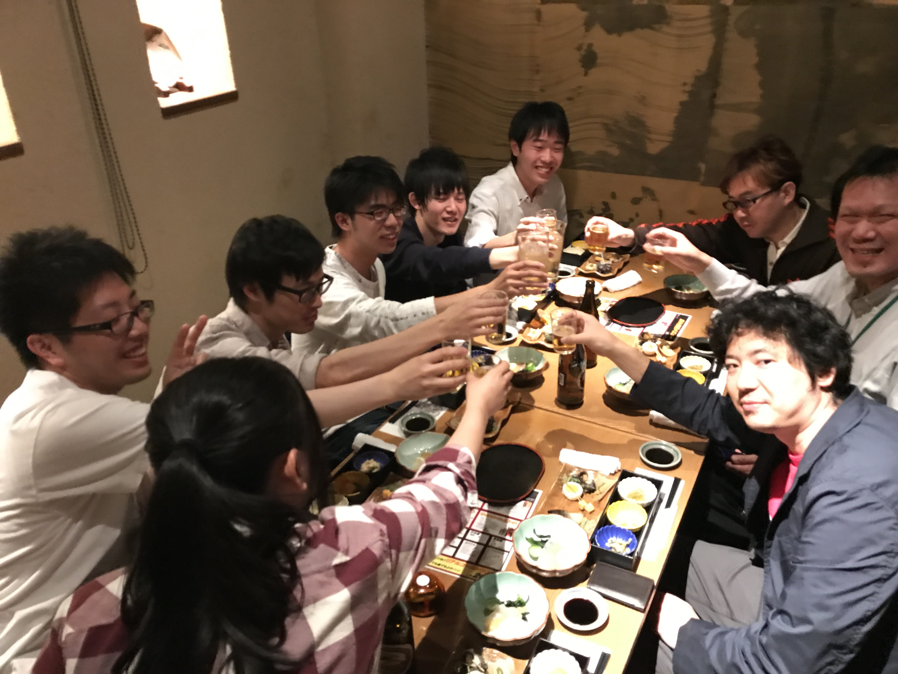
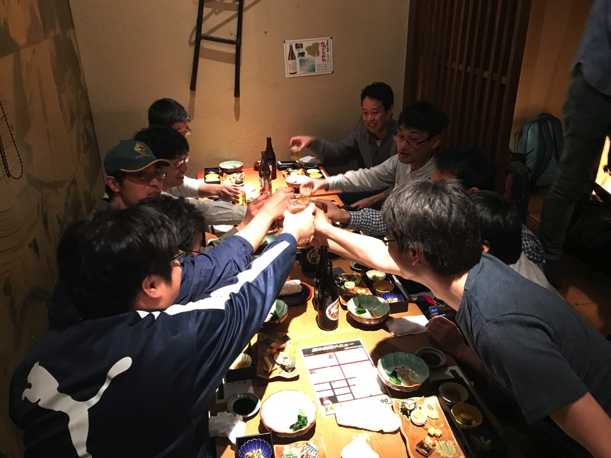

====================================
イベントの様子レポート
====================================

熊本大学にて開催
------------------------

晴天の下、熊本大学でPyCon mini Kumamto 2017を開催しました。
実行委員と当日ボランティア学生含めて約60名が参加したイベントになりました。
遠方からも多数参加者がいました。3名（1人5000円）の遠方者支援も行いました。

.. figure:: img/IMG_3572.jpg
   :alt: 熊大のレンガの門写真
   
.. figure:: img/IMG_3573.jpg
   :alt: 熊大のレンガの建造物写真

受付
------------
9:00〜に会場に集合をして、受付の準備を行いました。早めに来た参加者にも手伝ってもらい、準備を行いました。当日ぶっつけ本番で準備する状況でしたが、各々が柔軟に対応でき受付の準備を整えることができました。

受付のテーブルにノベリティやステッカーを置いて参加者に自由に取ってもらいました。スポンサーの名前一覧も写真にように配置しました。

9:30〜受付を開始し、集まりも非常によくスムーズに受付をできるようにしました。今回参加者に複数の属性があったので、首からさげるネームカードを配り、それを入場passにしました。

オープニング
----------------
10:00〜オープニングでは今回の実行委員長の森下が今回の開催の経緯などを説明し、スポンサーの名前を読み上げ、事務局の清田が注意事項やイベントの流れを説明して、基調講演を開始してもらいました。

基調講演
------------
10:15〜基調講演です。

トーク前半
------------

午前中は4本のトークを行いました。

.. figure:: img/DSC_5193.jpg
   :alt: まだ見ぬバグゼロという未来(初級) 新井 正貴
      
    まだ見ぬバグゼロという未来(初級) 新井 正貴

.. figure:: img/DSC_5200.jpg
   :alt: kivyの利便性や有用性(初級) 齋藤 大輔

.. figure:: img/DSC_5208.jpg
   :alt: ScrapyとRedashではじめる野球統計学〜福岡ソフトバンクホークスを添えて(初級) Shinichi Nakagawa(野球の人)

.. figure:: img/DSC_5212.jpg
   :alt: DjangoのDB migrationがどういうしくみで動いているか(初級) 野中 哲

ランチ
------------

ランチディスカッション
------------------------

.. figure:: img/DSC_5225.jpg
   :alt: ランチディスカッション1

.. figure:: img/DSC_5226.jpg
   :alt: ランチディスカッション2

.. figure:: img/DSC_5227.jpg
   :alt: ランチディスカッション3

.. figure:: img/DSC_5230.jpg
   :alt: ランチディスカッション4

トーク後半
------------

.. figure:: img/DSC_5238.jpg
   :alt: ボイスインターフェースの現状(仮)と、pythonを使ったフレームワーク(flask)でAmazon Echoがレスポンスを返すまで。 堀田 直孝

.. figure:: img/DSC_5240.jpg
   :alt: すぐ始められる、Pythonの環境構築(初級) 寺田 学

.. figure:: img/DSC_5248.jpg
   :alt: 数理モデリングからはじめるPython数理最適化（初級〜上級） Retty Inc. Data Scientist 岩永二郎

.. figure:: img/DSC_5253.jpg
   :alt: Pythonistaの使いかた jbking

.. figure:: img/DSC_5271.jpg
   :alt: Python@AWS LambdaとDjangoを使ってアスキーアート自動生成Webアプリを作ってみた 矢野 高宏

.. figure:: img/DSC_5260.jpg
   :alt: データ分析現場におけるPython活用事例の紹介 真嘉比 愛

写真撮影
------------

.. figure:: img/DSC_5281.jpg
   :alt: 写真撮影

LT
------------

.. figure:: img/DSC_5284.jpg
   :alt: 僕の考えた最強のプログラミング教育 今井

.. figure:: img/DSC_5296.jpg
   :alt: Python TDD体験をやったよ！ masakura

.. figure:: img/DSC_5296.jpg
   :alt: Python TDD体験をやったよ！ masakura

.. figure:: img/DSC_5300.jpg
   :alt: Micro Python + ESP32 西本

.. figure:: img/DSC_5300.jpg
   :alt: Micro Python + ESP32 西本

.. figure:: img/DSC_5308.jpg
   :alt: PyCon APAC 2017へ行こう！ 野中

クロージング
------------

.. figure:: img/DSC_5315.jpg
   :alt: 写真撮影

.. figure:: img/DSC_5327.jpg
   :alt: 実行委員メンバー

懇親会
------------

学生も3人参加しました。学生は参加費1000円徴収し、不足分は運営費用で補助することにしました。

